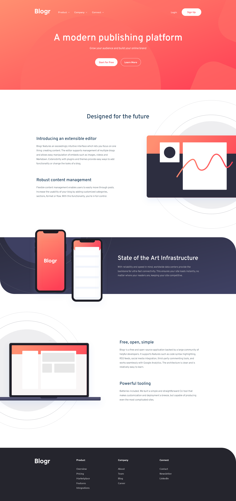

# Frontend Mentor - Blogr landing page solution

This is a solution to the [Blogr landing page challenge on Frontend Mentor](https://www.frontendmentor.io/challenges/blogr-landing-page-EX2RLAApP). Frontend Mentor challenges help you improve your coding skills by building realistic projects.

## Table of contents

- [Overview](#overview)
  - [The challenge](#the-challenge)
  - [Screenshot](#screenshot)
  - [Links](#links)
- [My process](#my-process)
  - [Built with](#built-with)
  - [What I learned](#what-i-learned)
  - [Continued development](#continued-development)
  - [Useful resources](#useful-resources)
- [Author](#author)
- [Acknowledgments](#acknowledgments)

## Overview

### The challenge

Users should be able to:

- View the optimal layout for the site depending on their device's screen size
- See hover states for all interactive elements on the page
- Toggle the links' dropdowns in the navigation bar
- See the transformation of the navigation bar items to a menu hamburger dropdown on mobile views

### Screenshot

**Note: Delete this note and the paragraphs above when you add your screenshot. If you prefer not to add a screenshot, feel free to remove this entire section.**

### Links

The site is live at the following link: https://AmazingTool777.github.io/blogr-landing-page-frontendmentors/

## My process

### Built with

- Semantic HTML5 markup
- SASS
- CSS custom properties
- Flexbox
- Mobile-first workflow
- Block Element Modifier a.k.a BEM methodology
- Custom javascript dropdowns
- Javascript ES6 modules
- Live Server
- Live SASS compiler

### What I learned

I'm just getting started with building concrete html pages through frontendmentors' challenges using sass and javascript so I definetely learned a bunch from this one project alone.
The first thing is splitting SASS code into individual modules. Writing the whole CSS code of page in one file can be hard to follow when the code becomes very huge so I thought about breaking down the whole style rules into different SASS files that are each responsible for styling distinct parts of the page or common page components. I've also isolated variable values and mixins as well. Reusing those scattered SASS files is possible thanks to the @use and @forward rules of (Dart) SASS.
Then, I've also learned how to manage the use the BEM approach of writing CSS accross the multiple parts of the page.
Also, I've also noticed that an image that has an absolute position has its height relative to the the nearest parent who the element is positioned to instead of relative to its direct parent element when the height of the image is expressed in percentage (%). I hope that statement makes sense 😜.
Next, I realized that background images are tricky to manipulate when we set very customized values for their positions. Due to that struggle, I barely managed to get the background images' positions close to those shown in the template.
Besides, I've figured out how to make responsive images by the use of the picture tag and that we in fact should select the img element within this element in order to style the image instead of the picture tag itself in the CSS.
Moreover, this is the first time that I achieved a responsive navigation bar that gets transformed into a clickable menu on narrow viewports without setting the styles in javascript.
Finally, with a bit of a success, I've been able to create to create a dropdown system using vanilla javascript and javscript modules for the collapsible elements on the page.

### Continued development

I'm just getting used to builing web pages with HTML, CSS and Javascript so it's no surprise that I see some mistakes and bad practices regarding the semantic markups, the styling design system and the accessibility considerations in the page although the visible result is rather good compared to the template. Therefore, there are a lot of things to work on for the subsequent projects to work on.
First, my SASS files structure needs to be more elaborate than the current one in order to provide more ease and flexibility to the styling management.
Then, I also need to work a lot on the accessibility support since the HTML attributes and the dropdown system in javascript that I wrote barely take that into account.
Finally, I will dive a little deeper on the techniques of background images positioning since I really struggled with it in this challenge so that I can deliver accurate results in that matter.

### Useful resources

- [MDN Web Docs](https://developer.mozilla.org) - They have like the official docs on practically all HTML, CSS and Javascript features so they were very helpful when I tried to understand how some features work as well as view their API reference.
- [W3Schools](https://www.w3schools.com) - It's plenty of ressources for learing web development and they have a lot of code examples that one can use as code snippet for whatever he/she wants to implement.

## Author

- Frontend Mentor - [@ToolTra](https://www.frontendmentor.io/profile/ToolTra)
- Instagram - [@amazing_tool](https://www.instagram.com/amazing_tool)

## Acknowledgments

For anyone tackling this challenge, make sure to be clever with the background image positioning since it was particularly the trickiest part of the devolopment process in my opinion. Also I'm also a big fan of Kevin Powell and Jessica Chan, two amazing frontend development tutorial makers' youtube channels who actually turn out to make me love and motivated in frontend development.
